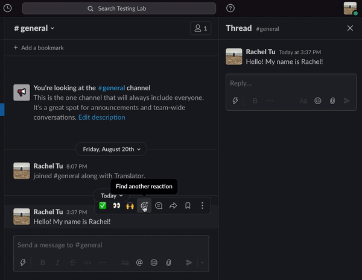

# Translate App 
A Slack App that translates messages with the click of a reaction!

## Description
Built using Slack's Bolt framework, this app allows users to translate a message by reacting to it with a flag emoji. Once an emoji is clicked, the translated text will show up as a threaded message. 

## Demo

## Dependencies 
- https://www.npmjs.com/package/country-language
- https://cloud.google.com/translate
